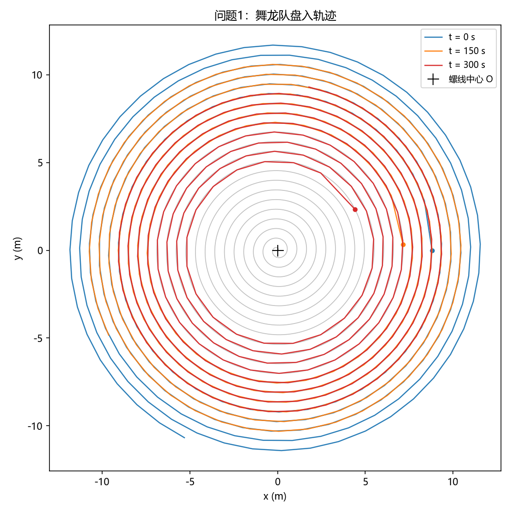
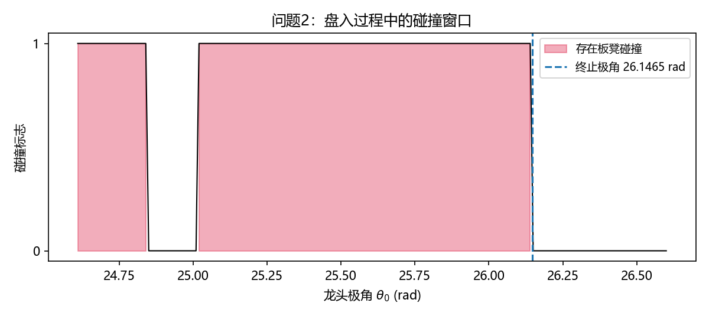
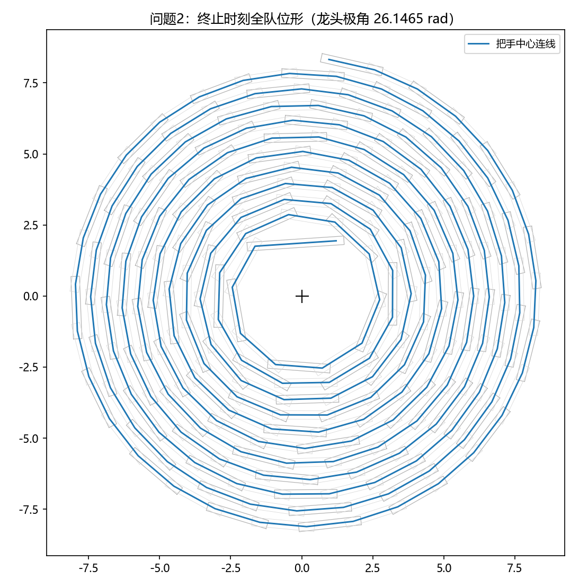
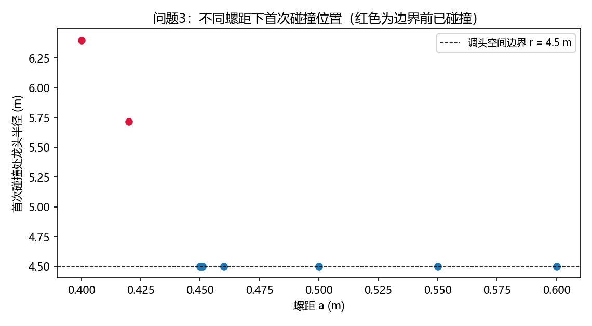
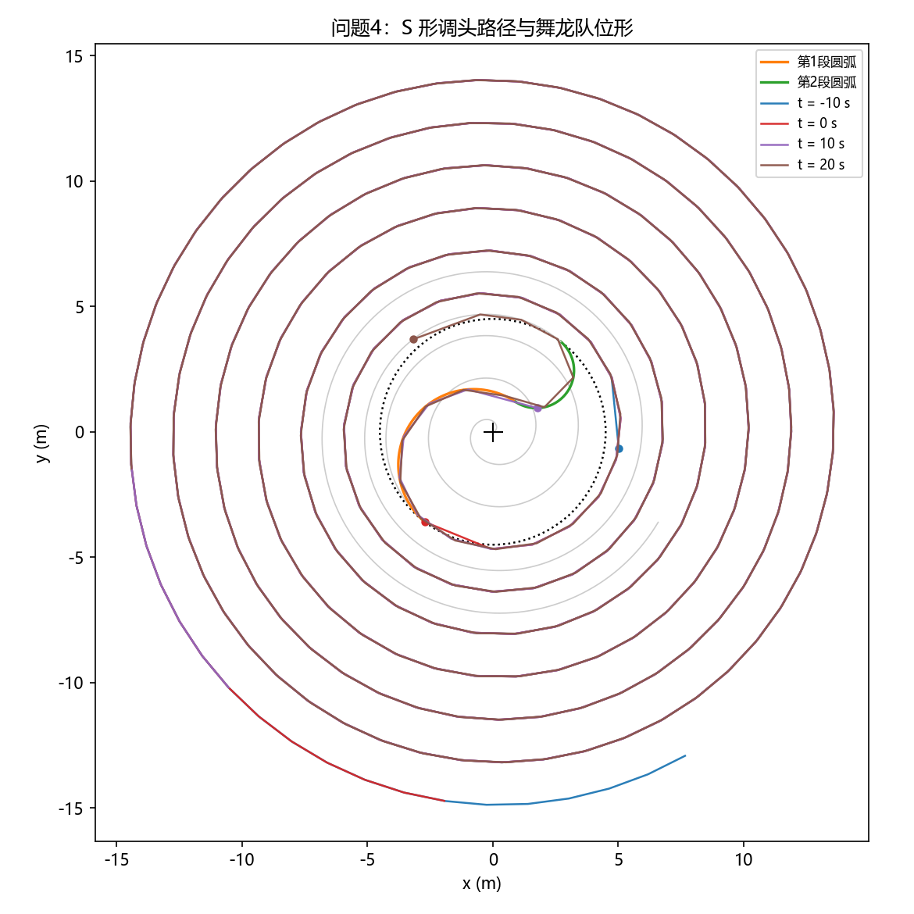
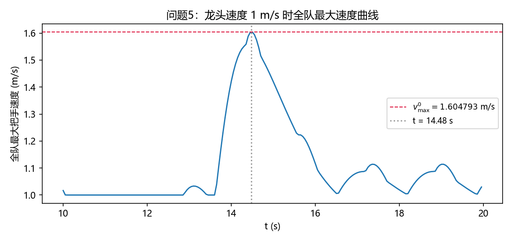

# 2024 年高教社杯全国大学生数学建模竞赛 A 题“板凳龙”闹元宵

## 模型建立与求解报告

> 本报告严格依据命题人蔡志杰撰写的讲评《板凳龙运动轨迹模型的分析研究》复刻其核心模型：龙头运动的常微分方程模型、龙身/龙尾运动的弦长递推模型、速度递推模型、板凳碰撞判别模型、调头曲线模型与最大速度缩放模型，并给出每题的程序实现与结果。

---

## 1 问题概述与符号说明

某板凳龙由 223 节板凳组成（第 1 节为龙头、第 2～222 节为龙身、第 223 节为龙尾）。龙头板长 341 cm，其余板长 220 cm，板宽 30 cm；每节板凳两端各有一个孔径 5.5 cm 的孔，孔中心距最近板头 27.5 cm；相邻板凳通过把手在孔处连接。由此，**同一节板凳上两个把手中心（孔中心）之间的距离**为

$$
l_i = \begin{cases}
341-2\times 27.5 = 286\ \mathrm{cm}, & i=0\ \text{（龙头）},\\[2pt]
220-2\times 27.5 = 165\ \mathrm{cm}, & i=1,2,\dots,222\ \text{（龙身、龙尾）}.
\end{cases}
$$

把手点共 224 个，记为 $P_0, P_1, \dots, P_{223}$：$P_0$ 为龙头前把手，$P_1\sim P_{221}$ 为第 1～221 节龙身前把手，$P_{222}$ 为龙尾前把手，$P_{223}$ 为龙尾后把手。$l_i=|P_{i+1}-P_i|$。

| 符号 | 含义 |
|---|---|
| $a$ | 等距螺线螺距 |
| $r$ | 调头空间半径（$r=4.5$ m） |
| $v_0$ | 龙头前把手行进速度 |
| $\theta_i$ | $P_i$ 的极角 |
| $\rho_i$ | $P_i$ 的极径 |
| $P_i(x_i,y_i)$ | 第 $i$ 个把手中心的直角坐标 |
| $d_i$ | 板头伸出孔外的长度，$d_i=27.5$ cm |
| $\omega_i$ | 板凳半宽，$\omega_i=15$ cm |
| $\theta_0(0)$ | 龙头初始极角，$\theta_0(0)=32\pi$（第 16 圈 A 点） |

初始时刻龙头位于第 16 圈 A 点：以螺线中心为极点、$A$ 在正 $x$ 轴上，则

$$
\theta_0(0)=16\times 2\pi=32\pi,\qquad P_0(0)=(8.8,\ 0)\ \mathrm{m}.
$$

## 2 模型假设

1. 龙头前把手始终以恒定速度 $v_0$ 沿螺线运动，方向与路径相切；
2. 所有把手中心均位于相应路径（螺线或圆弧）上；
3. 板凳为刚体，相邻把手间距离 $l_i$ 恒定，把手可在孔中自由转动；
4. 各板凳宽度、孔位尺寸恒定，忽略板凳厚度；
5. 两条不相邻板凳的矩形轮廓发生重叠（任一边相交）即视为碰撞；
6. 舞龙队由初始位置向中心盘入，途中不发生打滑、脱离。

## 3 基础模型

### 3.1 盘入螺线与龙头运动模型（常微分方程模型）

等距螺线（阿基米德螺线）的极坐标方程为

$$
\rho=\frac{a}{2\pi}\theta,
\tag{1}
$$

故 $P_i$ 的直角坐标为

$$
x_i=\frac{a}{2\pi}\theta_i\cos\theta_i,\qquad
y_i=\frac{a}{2\pi}\theta_i\sin\theta_i .
\tag{2}
$$

龙头前把手 $P_0$ 以速度 $v_0$ 运动，其速度平方为

$$
v_0^2=\left(\frac{\mathrm{d}x_0}{\mathrm{d}t}\right)^2+
\left(\frac{\mathrm{d}y_0}{\mathrm{d}t}\right)^2
=\frac{a^2}{4\pi^2}\left(1+\theta_0^2\right)
\left(\frac{\mathrm{d}\theta_0}{\mathrm{d}t}\right)^2.
\tag{3}
$$

盘入时 $\theta_0$ 随时间减小，于是得到**龙头极角的常微分方程**：

$$
\frac{\mathrm{d}\theta_0}{\mathrm{d}t}
=-\frac{2\pi v_0}{a\sqrt{1+\theta_0^2}}.
\tag{4}
$$

令 $G(\theta)=\theta\sqrt{1+\theta^2}+\ln\bigl(\theta+\sqrt{1+\theta^2}\bigr)$，积分得

$$
G(\theta_0(t))=G(\theta_0(0))-\frac{4\pi v_0}{a}t.
\tag{5}
$$

由弧长公式亦可直接得到相同的结论：螺线上从 $\theta_2$ 到 $\theta_1$（$\theta_1>\theta_2$）的弧长为

$$
s=\int_{\theta_2}^{\theta_1}\sqrt{\rho^2+\left(\frac{\mathrm{d}\rho}{\mathrm{d}\theta}\right)^2}\,\mathrm{d}\theta
=\frac{a}{4\pi}\left[G(\theta)\right]_{\theta_2}^{\theta_1},
\tag{52}
$$

于是

$$
v_0t=\frac{a}{4\pi}\left[G(\theta_0(0))-G(\theta_0(t))\right],
\tag{53}
$$

与式 (5) 一致。对给定时刻 $t$，用单调函数求根即可得到 $\theta_0(t)$，再代入式 (2) 得龙头位置。

### 3.2 龙身、龙尾把手位置递推模型

已知第 $i$ 个把手 $P_i$ 位于螺线上、极角为 $\theta_i$，且 $|P_{i+1}-P_i|=l_i$，由余弦定理（讲评式 (6)、(40)）：

$$
l_i^2=\rho_i^2+\rho_{i+1}^2-2\rho_i\rho_{i+1}\cos(\theta_{i+1}-\theta_i)
=\frac{a^2}{4\pi^2}\left[\theta_i^2+\theta_{i+1}^2
-2\theta_i\theta_{i+1}\cos(\theta_{i+1}-\theta_i)\right].
\tag{6}
$$

对盘入螺线，后一个把手在龙头后方（$\theta_{i+1}>\theta_i$），故在区间 $(\theta_i,\ \theta_i+2\pi)$ 内求式 (6) 的唯一根即得 $\theta_{i+1}$；依次递推可得 $P_1,\dots,P_{223}$。若区间内无解，说明板凳无法在该位置容纳，视为不可行（碰撞）。此递推即讲评第 6 节“情形 1～4”的统一弧长参数化实现：把整条路径（盘入螺线＋圆弧＋盘出螺线）参数化为弧长 $s$，后把手为沿路径向后第一个满足弦长等于 $l_i$ 的点。

### 3.3 速度递推模型

板凳为刚体，前后把手沿板凳方向的速度分量相等（讲评式 (57)～(61)）。记 $u_i=\mathrm{d}s_i/\mathrm{d}t$ 为把手沿路径的弧长速率，$\boldsymbol{\tau}_i$ 为路径单位切向量，则弦长约束 $|P_{i+1}-P_i|=l_i$ 对时间求导得

$$
\boldsymbol{\tau}_{i+1}u_{i+1}-\boldsymbol{\tau}_i u_i
\perp (P_{i+1}-P_i),
$$

即

$$
u_{i+1}=\frac{(P_{i+1}-P_i)\cdot\boldsymbol{\tau}_i}
{(P_{i+1}-P_i)\cdot\boldsymbol{\tau}_{i+1}}\,u_i,
\qquad |\boldsymbol{v}_i|=|u_i|.
\tag{7}
$$

对纯螺线情形，上式与讲评式 (7)～(9) 等价：

$$
\frac{\mathrm{d}\theta_{i+1}}{\mathrm{d}t}
=
\frac{\theta_{i+1}\cos\Delta-\theta_i+\theta_i\theta_{i+1}\sin\Delta}
{\theta_{i+1}-\theta_i\cos\Delta+\theta_i\theta_{i+1}\sin\Delta}
\frac{\mathrm{d}\theta_i}{\mathrm{d}t},
\qquad \Delta=\theta_{i+1}-\theta_i,
\tag{8}
$$

$$
|\boldsymbol{v}_{i+1}|
=\left|\frac{\theta_{i+1}\cos\Delta-\theta_i+\theta_i\theta_{i+1}\sin\Delta}
{\theta_{i+1}-\theta_i\cos\Delta+\theta_i\theta_{i+1}\sin\Delta}\right|
\sqrt{\frac{1+\theta_{i+1}^2}{1+\theta_i^2}}\,|\boldsymbol{v}_i|.
\tag{9}
$$

### 3.4 板凳矩形与碰撞判别模型

第 $i$ 条板凳（连接 $P_i$、$P_{i+1}$，长 $l_i$、宽 $2\omega_i$）的四个顶点 $Q_i,R_i,S_i,T_i$ 按讲评式 (10)～(17) 计算：

$$
\begin{aligned}
Q_i&=P_i+\frac{l_i+d_i}{l_i}(P_{i+1}-P_i)+\frac{\omega_i}{l_i}\mathbf{R}(P_{i+1}-P_i),\\
R_i&=P_i+\frac{l_i+d_i}{l_i}(P_{i+1}-P_i)-\frac{\omega_i}{l_i}\mathbf{R}(P_{i+1}-P_i),\\
S_i&=P_i-\frac{d_i}{l_i}(P_{i+1}-P_i)-\frac{\omega_i}{l_i}\mathbf{R}(P_{i+1}-P_i),\\
T_i&=P_i-\frac{d_i}{l_i}(P_{i+1}-P_i)+\frac{\omega_i}{l_i}\mathbf{R}(P_{i+1}-P_i),
\end{aligned}
\tag{10}
$$

其中 $\mathbf{R}(x,y)=(y,-x)$ 表示逆时针旋转 $90^\circ$，$d_i=0.275$ m，$\omega_i=0.15$ m。

对任意两条**不相邻**板凳 $C_i$、$C_j$（$j\neq i-1,i,i+1$），二者不碰撞当且仅当 $C_i$ 的任意一条边与 $C_j$ 的任意一条边不相交。对线段 $AB$ 与 $CD$，令 $p_i=x_B-x_A$，$q_i=y_B-y_A$，$p_j=x_D-x_C$，$q_j=y_D-y_C$，$\Delta=p_jq_i-p_iq_j$，当 $\Delta\neq 0$ 时交点参数为

$$
t=\frac{p_j(y_C-y_A)-q_j(x_C-x_A)}{\Delta},\qquad
s=\frac{p_i(y_C-y_A)-q_i(x_C-x_A)}{\Delta},
\tag{11}
$$

若 $0\le s,t\le 1$ 则两线段相交；$\Delta=0$ 时再按平行/共线情形判断（讲评式 (18)～(27)）。任意一条边相交即判定两板凳碰撞。

> 讲评 8.4 节还给出了等价判据：中轴线距离判别法、面积判别法和分离轴判别法。本报告采用讲评正文的矩形边-边相交法，它与“两个矩形是否重叠”的官方评阅口径一致。

---

## 4 问题 1：0～300 s 全队位置与速度

### 4.1 求解算法

1. 对 $t=0,1,\dots,300$ s，由式 (5) 求根得到龙头极角 $\theta_0(t)$；
2. 由 3.2 节递推得到全部 224 个把手的极角与直角坐标；
3. 由 3.3 节递推得到各把手速度大小；
4. 按附件模板写入 `result1.xlsx`（位置、速度各一张表，保留 6 位小数）。

### 4.2 结果



**表 1　论文要求时刻的位置结果（单位：m）**

| 把手 | 0 s | 60 s | 120 s | 180 s | 240 s | 300 s |
|---|---:|---:|---:|---:|---:|---:|
| 龙头 x | 8.800000 | 5.799209 | -4.084887 | -2.963609 | 2.594494 | 4.420274 |
| 龙头 y | 0.000000 | -5.771092 | -6.304479 | 6.094780 | -5.356743 | 2.320429 |
| 第1节龙身 x | 8.363824 | 7.456758 | -1.445473 | -5.237118 | 4.821221 | 2.459489 |
| 第1节龙身 y | 2.826544 | -3.440399 | -7.405883 | 4.359627 | -3.561949 | 4.402476 |
| 第51节龙身 x | -9.518732 | -8.686317 | -5.543150 | 2.890455 | 5.980011 | -6.301346 |
| 第51节龙身 y | 1.341137 | 2.540108 | 6.377946 | 7.249289 | -3.827758 | 0.465829 |
| 第101节龙身 x | 2.913983 | 5.687116 | 5.361939 | 1.898794 | -4.917371 | -6.237722 |
| 第101节龙身 y | -9.918311 | -8.001384 | -7.557638 | -8.471614 | -6.379874 | 3.936008 |
| 第151节龙身 x | 10.861726 | 6.682311 | 2.388757 | 1.005154 | 2.965378 | 7.040740 |
| 第151节龙身 y | 1.828753 | 8.134544 | 9.727411 | 9.424751 | 8.399721 | 4.393013 |
| 第201节龙身 x | 4.555102 | -6.619664 | -10.627211 | -9.287720 | -7.457151 | -7.458662 |
| 第201节龙身 y | 10.725118 | 9.025570 | 1.359847 | -4.246673 | -6.180726 | -5.263384 |
| 龙尾（后）x | -5.305444 | 7.364557 | 10.974348 | 7.383896 | 3.241051 | 1.785033 |
| 龙尾（后）y | -10.676584 | -8.797992 | 0.843473 | 7.492370 | 9.469336 | 9.301164 |

**表 2　论文要求时刻的速度结果（单位：m/s）**

| 把手 | 0 s | 60 s | 120 s | 180 s | 240 s | 300 s |
|---|---:|---:|---:|---:|---:|---:|
| 龙头 | 1.000000 | 1.000000 | 1.000000 | 1.000000 | 1.000000 | 1.000000 |
| 第1节龙身 | 0.999971 | 0.999961 | 0.999945 | 0.999917 | 0.999859 | 0.999709 |
| 第51节龙身 | 0.999742 | 0.999662 | 0.999538 | 0.999331 | 0.998941 | 0.998065 |
| 第101节龙身 | 0.999575 | 0.999453 | 0.999269 | 0.998971 | 0.998435 | 0.997302 |
| 第151节龙身 | 0.999448 | 0.999299 | 0.999078 | 0.998727 | 0.998115 | 0.996861 |
| 第201节龙身 | 0.999348 | 0.999180 | 0.998935 | 0.998551 | 0.997894 | 0.996574 |
| 龙尾（后） | 0.999311 | 0.999136 | 0.998883 | 0.998489 | 0.997816 | 0.996478 |

每秒完整数据见 `results/result1.xlsx`。

---

## 5 问题 2：盘入终止时刻

### 5.1 模型与算法

舞龙队继续盘入的条件是任意两条不相邻板凳不发生碰撞。由 3.4 节对每个候选龙头极角 $\theta_0$ 计算全队位形并判别碰撞。

数值实验表明，碰撞标志随 $\theta_0$ **并非严格单调**：从外向内盘入时，可能出现“碰撞—分离—再碰撞”的窗口结构（见图）。因此不能直接在整个区间上二分，求解分两步：

1. **找首次碰撞窗口**：从初始极角 $32\pi$ 向内粗扫（步长 0.2 rad），在 $27\sim25$ rad 区间加密到 0.02 rad，得到第一个出现碰撞的窗口；
2. **窗口边界二分**：在窗口边界两侧（一侧碰撞、一侧不碰撞）二分 60 次，取“仍不碰撞”一侧为终止极角 $\theta_0(T)$；
3. 由式 (53) 计算终止时刻

$$
T=\frac{a}{4\pi v_0}\left[G(\theta_0(0))-G(\theta_0(T))\right].
\tag{12}
$$



### 5.2 结果

**首次碰撞窗口位于 $\theta_0\approx 26.14$ rad**，二分得到

$$
\theta_0(T)=26.1465348\ \mathrm{rad},\qquad
T=412.473838\ \mathrm{s}.
$$

即舞龙队在 **412.474 s** 时不能再继续盘入，此时龙头前把手距螺线中心

$$
\rho_0(T)=\frac{a}{2\pi}\theta_0(T)=2.288743\ \mathrm{m}.
$$



**表 3　终止时刻指定把手的位置与速度**

| 把手 | x (m) | y (m) | 速度 (m/s) |
|---|---:|---:|---:|
| 龙头 | 1.209931 | 1.942784 | 1.000000 |
| 第1节龙身 | -1.643792 | 1.753399 | 0.991551 |
| 第51节龙身 | 1.281201 | 4.326588 | 0.976858 |
| 第101节龙身 | -0.536246 | -5.880138 | 0.974550 |
| 第151节龙身 | 0.968840 | -6.957479 | 0.973608 |
| 第201节龙身 | -7.893161 | -1.230764 | 0.973096 |
| 龙尾（后） | 0.956217 | 8.322736 | 0.972938 |

全部 224 个把手的数据见 `results/result2.xlsx`。

---

## 6 问题 3：最小螺距

### 6.1 模型与算法

调头空间是以螺线中心为圆心、直径 9 m 的圆（$r=4.5$ m）。盘入螺线与调头空间的交点极角为

$$
\theta_1=\frac{2\pi r}{a}.
\tag{13}
$$

要求龙头前把手能沿螺线从初始位置（$32\pi$）盘入到 $\theta_1$，**整个过程中**任意两条不相邻板凳均不碰撞，即

$$
\text{碰撞}(\theta_0)=0,\qquad \forall\,\theta_0\in[\theta_1,\ 32\pi].
\tag{14}
$$

螺距越小，相邻圈之间越挤、越易碰撞，故**最小螺距问题**为

$$
a_{\min}=\min\bigl\{a>0:\ \text{式 (14) 成立}\bigr\}.
\tag{15}
$$

求解采用二分法：对候选 $a$，从 $\theta_0=32\pi$ 向 $\theta_1$ 扫描（外层步长 0.5 rad，$\theta_1$ 附近加密到 0.02 rad），任一配置发生碰撞即不可行。数值实验表明，临界螺距附近的碰撞窗口很窄（约 0.1 rad），因此必须在 $\theta_1$ 附近精细扫描。



### 6.2 结果

$$
\boxed{\,a_{\min}=0.45033645\ \mathrm{m}\approx 45.0\ \mathrm{cm}\,}
$$

对应

$$
\theta_1=62.7849\ \mathrm{rad}.
$$

即螺距至少约 **45.0 cm**，龙头前把手才能在整队不发生碰撞的前提下盘入到调头空间边界。

---

## 7 问题 4：S 形调头曲线与 −100～100 s 全队状态

### 7.1 调头曲线模型

盘入螺线螺距 $a=1.7$ m；盘出螺线与盘入螺线关于螺线中心中心对称，其极坐标方程为

$$
\rho=\frac{a}{2\pi}(\theta+\pi).
\tag{16}
$$

盘入螺线与调头空间（半径 $r=4.5$ m）交于点 $P_1$，其极角为

$$
\theta_1=\frac{2\pi r}{a},
\tag{17}
$$

该点处的单位法向量为

$$
\boldsymbol{n}_1=\frac{1}{\sqrt{1+\theta_1^2}}
\bigl(-(\sin\theta_1+\theta_1\cos\theta_1),\ \cos\theta_1-\theta_1\sin\theta_1\bigr).
\tag{18}
$$

记两段圆弧圆心为 $O_1(u_1,v_1)$、$O_2(u_2,v_2)$，半径 $r_1,r_2$，则（讲评式 (32)～(33)）

$$
\begin{aligned}
O_1&=P_1-r_1\boldsymbol{n}_1,\\
O_2&=-P_1+r_2\boldsymbol{n}_1 .
\end{aligned}
\tag{19}
$$

两段圆弧相切（$|O_1O_2|=r_1+r_2$），从而

$$
r_1+r_2=\frac{r\sqrt{1+\theta_1^2}}{\theta_1}.
\tag{20}
$$

当第 1 段圆弧半径是第 2 段的 $k$ 倍（$r_1=kr_2$）时，

$$
r_1=\frac{kr\sqrt{1+\theta_1^2}}{\theta_1(k+1)},\qquad
r_2=\frac{r\sqrt{1+\theta_1^2}}{\theta_1(k+1)}.
\tag{21}
$$

设两圆弧切点为 $B$。由 $O_1P_1\parallel O_2P_2$，$\angle P_1O_1B=\angle P_2O_2B\triangleq\alpha$，调头曲线总长为

$$
L=(r_1+r_2)\alpha=\frac{r\alpha\sqrt{1+\theta_1^2}}{\theta_1}.
\tag{22}
$$

**调头曲线能否缩短？——不能。** 理由如下：

1. 由式 (20)，$r_1+r_2$ 只由 $r$、$a$ 决定，**与 $k$ 无关**；
2. 对任意半径比 $k$，两段圆弧的圆心 $O_1',O_2'$ 与切点 $B'$ 满足 $O_1O_1'=O_2O_2'$，四边形 $O_1O_1'O_2'O_2$ 为平行四边形，故 $\angle P_1O_1B=\angle P_1O_1'B'$、$\angle P_2O_2B=\angle P_2O_2'B'$，即两圆弧所张圆心角之和 $\alpha$ **也与 $k$ 无关**；
3. 因此 $L=(r_1+r_2)\alpha$ 与 $k$ 无关，**保持相切的前提下无法通过调整两段圆弧的半径比使调头曲线变短**。

数值验证（$a=1.7$ m，$r=4.5$ m）：

| 半径比 $k$ | $r_1$ (m) | $r_2$ (m) | 圆心角 $\alpha$ (rad) | 调头长度 $L$ (m) |
|---:|---:|---:|---:|---:|
| 1 | 2.254063 | 2.254063 | 3.021487 | 13.621245 |
| 2 | 3.005418 | 1.502709 | 3.021487 | 13.621245 |
| 3 | 3.381095 | 1.127032 | 3.021487 | 13.621245 |
| 5 | 3.756772 | 0.751354 | 3.021487 | 13.621245 |
| 10 | 4.098297 | 0.409830 | 3.021487 | 13.621245 |

本问取 $k=2$，关键几何量为：

$$
\begin{aligned}
P_1&=(-2.711856,\ -3.591078), & P_2&=(2.711856,\ 3.591078),\\
O_1&=(-0.760009,\ -1.305726), & O_2&=(1.735932,\ 2.448402),\\
B&=(0.903952,\ 1.197026), & r_1&=3.005418,\ r_2=1.502709,\\
\alpha&=3.021487\ \mathrm{rad}, & L&=13.621245\ \mathrm{m}.
\end{aligned}
$$

### 7.2 盘出路径与全队状态

盘出时龙头极角满足

$$
\frac{\mathrm{d}\theta_0}{\mathrm{d}t}=\frac{2\pi v_0}{a\sqrt{1+\theta_0^2}},
\qquad
G(\theta_0(t))=\frac{4\pi v_0}{a}t+G(\theta_0(0)).
\tag{23}
$$

以调头开始时刻为 $t=0$：$t<0$ 龙头在盘入螺线上，$0\le t<L_1=r_1\alpha$ 在第 1 段圆弧上，$L_1\le t<L$ 在第 2 段圆弧上，$t\ge L$ 在盘出螺线上。龙身/龙尾各把手沿路径向后按“弦长递推”确定（等价于讲评式 (40)～(49) 的四种情形），速度按 3.3 节统一递推。



### 7.3 结果

**表 4　论文要求时刻的位置结果（单位：m）**

| 把手 | -100 s | -50 s | 0 s | 50 s | 100 s |
|---|---:|---:|---:|---:|---:|
| 龙头 x | 7.778034 | 6.608301 | -2.711856 | 1.332696 | -3.157229 |
| 龙头 y | 3.717164 | 1.898865 | -3.591078 | 6.175324 | 7.548511 |
| 第1节龙身 x | 6.209273 | 5.366911 | -0.063534 | 3.862265 | -0.346890 |
| 第1节龙身 y | 6.108521 | 4.475403 | -4.670888 | 4.840828 | 8.079166 |
| 第51节龙身 x | -10.608038 | -3.629945 | 2.459962 | -1.671385 | 2.095033 |
| 第51节龙身 y | 2.831491 | -8.963800 | -7.778145 | -6.076713 | 4.033787 |
| 第101节龙身 x | -11.922761 | 10.125787 | 3.008493 | -7.591816 | -7.288774 |
| 第101节龙身 y | -4.802378 | -5.972247 | 10.108539 | 5.175487 | 2.063875 |
| 第151节龙身 x | -14.351032 | 12.974784 | -7.002789 | -4.605165 | 9.462513 |
| 第151节龙身 y | -1.980993 | -3.810357 | 10.337482 | -10.386988 | -3.540357 |
| 第201节龙身 x | -11.952942 | 10.522509 | -6.872842 | 0.336952 | 8.524374 |
| 第201节龙身 y | 10.566998 | -10.807425 | 12.382609 | -13.177610 | 8.606933 |
| 龙尾（后）x | -1.011059 | 0.189809 | -1.933627 | 5.859094 | -10.980157 |
| 龙尾（后）y | -16.527573 | 15.720588 | -14.713128 | 12.612894 | -6.770006 |

**表 5　论文要求时刻的速度结果（单位：m/s）**

| 把手 | -100 s | -50 s | 0 s | 50 s | 100 s |
|---|---:|---:|---:|---:|---:|
| 龙头 | 1.000000 | 1.000000 | 1.000000 | 1.000000 | 1.000000 |
| 第1节龙身 | 0.999904 | 0.999762 | 0.998687 | 1.000363 | 1.000124 |
| 第51节龙身 | 0.999346 | 0.998642 | 0.995134 | 0.949935 | 1.003966 |
| 第101节龙身 | 0.999091 | 0.998248 | 0.994448 | 0.948482 | 1.096263 |
| 第151节龙身 | 0.998944 | 0.998047 | 0.994156 | 0.948038 | 1.095306 |
| 第201节龙身 | 0.998849 | 0.997925 | 0.993994 | 0.947823 | 1.094933 |
| 龙尾（后） | 0.998817 | 0.997885 | 0.993944 | 0.947760 | 1.094833 |

每秒完整数据见 `results/result4.xlsx`。

---

## 8 问题 5：龙头最大行进速度

### 8.1 模型

速度递推 (7)～(9) 关于龙头速度是**齐次线性**的：龙头速度变为 $v_0$ 时，所有把手速度同步乘以 $v_0$。因此先取龙头速度 $1$ m/s，计算整个行进过程中全队最大速度 $v_{\max}^{0}$，则约束“各把手速度不超过 2 m/s”等价于

$$
\frac{v_{\max}}{1}=\frac{2}{v_{\max}^{0}},
\tag{24}
$$

即

$$
v_{\max}=\frac{2}{v_{\max}^{0}}.
\tag{25}
$$

### 8.2 求解算法

1. 沿问题 4 路径，以龙头速度 1 m/s 计算 $t\in[-100,400]$ s（覆盖全队通过调头区）各时刻全部把手速度；
2. 在峰值附近加密采样（步长 0.002 s）；
3. 记录全队最大速度 $v_{\max}^{0}$ 及其出现的把手、时刻；
4. 按式 (25) 计算 $v_{\max}$。



### 8.3 结果

$$
v_{\max}^{0}=1.60479338\ \mathrm{m/s},
$$

出现在 $t=14.48$ s（龙头刚离开调头曲线进入盘出螺线时），最大速度把手为**第 3 节龙身前把手**（位于第 1 段圆弧与第 2 段圆弧衔接处附近）。因此

$$
\boxed{\,v_{\max}=\frac{2}{1.60479338}=1.24626636\ \mathrm{m/s}\,}
$$

即龙头前把手速度最大可取约 **1.2463 m/s**，此时第 3 节龙身前把手速度恰为 2 m/s。

---

## 9 程序结构与复现

```
2024A/
├── A题.pdf                    # 赛题原文
├── A题_解题文档.md             # 完整解题文档（模型、算法、结果）
├── 附件1.xlsx                 # 题目附件模板（result1 结果模板）
├── 附件2.xlsx                 # 题目附件模板（result2 结果模板）
├── 附件4.xlsx                 # 题目附件模板（result4 结果模板）
├── src/
│   ├── benchloong/            # 共享模型库
│   │   ├── config.py          #   几何常量（板长、孔位、初始极角等）
│   │   ├── geometry.py        #   螺线/圆弧路径、弧长-极角反解
│   │   ├── chain.py           #   弦长递推、速度递推、碰撞判别
│   │   └── io_utils.py        #   按模板写 result*.xlsx
│   ├── q1.py                  # 问题 1：0~300 s 全队位置速度
│   ├── q2.py                  # 问题 2：终止时刻（首次碰撞窗口 + 二分）
│   ├── q3.py                  # 问题 3：最小螺距（全过程可行性 + 二分）
│   ├── q4.py                  # 问题 4：调头曲线不变量 + -100~100 s 状态
│   ├── q5.py                  # 问题 5：最大龙头速度（速度线性缩放）
│   ├── make_figures.py        # 生成报告插图
│   └── make_animations.py     # 生成可视化动画
├── figures/                   # 插图（q*.png）
├── animations/                # 动画（q*.mp4）
└── results/                   # 求解结果（result1/2/4.xlsx）
```

运行方式（在项目根目录）：

```bash
python src/q1.py
python src/q2.py
python src/q3.py
python src/q4.py
python src/q5.py
python src/make_figures.py
python src/make_animations.py
```

依赖：`numpy`、`scipy`、`openpyxl`、`matplotlib`（见 `requirements.txt`）。各问独立成程序，共享库只提供模型函数，符合“多问求解不放在同一程序”的要求。

---

## 附录：可视化动画

`animations/` 下提供五个问题的 MP4 动画（`python src/make_animations.py` 可重新生成）。动画中每条板凳按其实际轮廓绘制，龙头前把手用红点标出：

| 文件 | 内容 |
|---|---|
| `q1_spiral_in.mp4` | 问题 1：0～300 s 盘入全过程 |
| `q2_terminal.mp4` | 问题 2：终止时刻前 27.5 s，碰撞对间距逼近 0（上图为间距曲线，下图为全队位形，红色为碰撞对） |
| `q3_min_pitch.mp4` | 问题 3：最小螺距 0.4503 m 下从初始位置盘入到调头空间边界 |
| `q4_turn.mp4` | 问题 4：盘入—S 形调头—盘出（-100～100 s，绿色虚线为调头空间） |
| `q5_speed.mp4` | 问题 5：调头区附近速度分布 + 全队最大速度实时曲线 |

---

## 10 结果验证

与 2024 年竞赛官方论文展示（A163）对比：

| 项目 | 本报告 | 官方展示论文 A163 | 一致性 |
|---|---:|---:|---|
| 问题 1 位置/速度表 | 见 §4.2 | 同表 | 逐位一致 |
| 问题 2 终止时刻 | 412.473838 s | 412.473894 s | 一致（判据细节差异 < 6e-5 s） |
| 问题 2 终止位形 | 龙头 (1.209931, 1.942784) | 同 | 逐位一致 |
| 问题 3 最小螺距 | 0.45033645 m | 0.450338 m | 一致（差异 < 2e-6 m） |
| 问题 4 几何量 | $P_1,O_1,O_2,B,P_2,\alpha$ | 同 | 逐位一致 |
| 问题 5 最大速度 | 1.604793 / 1.246266 m/s | 1.604793 / 1.246266 m/s | 逐位一致 |

说明：问题 2、3 中“碰撞”的口径采用命题人讲评的**矩形重叠（边-边相交）模型**，这也是官方评阅要点“判断两个矩形是否有重叠部分”的口径；若采用角点-板身直线距离等更保守的判据，数值会有小幅差异，但结论不变。
